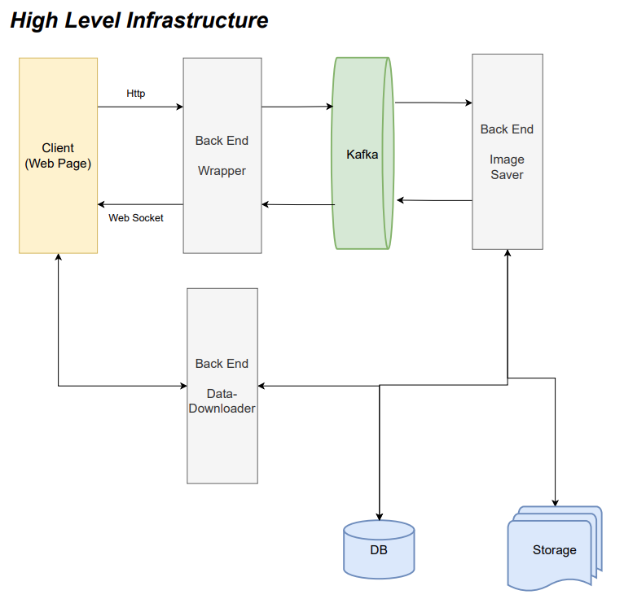

# lumos_image

Lumos Images

## Background and Concept

This implementation is just learning purpose in order to learn below idea.

When sending data from the front-end to the back-end, if the back-end processing takes a long time, the front-end cannot do other tasks because it waits for the back-end processing to complete. This results in making users wait.  
Therefore, a mechanism is constructed where the front-end sends data to a queue and the back-end starts receiving data from the queue, and when it completes processing, the back-end sends the data back to the queue and the front-end receives the completion from the queue. This decouples the front-end and back-end, freeing the front-end from being dependent on the back-end processing speed.  
 The purpose is to actually implement such a mechanism.

In this applications, there are below applications.

- frond-end
- backend-wrapeer
- zoo-keeper
- kafka
- backend-image-saver
- backend-data-downloader
- mysql

Why I use Kafka for this is to notify the front-end that the process of backend was completed.

### front-end

This is UI that a user upload image and process that images by using p5 modlues

### backend-wrapper

This is nodejs application using expressjs.  
This is a kust wapper api interact with front-end and kafka.

### backend-image-saver

This is nodejs application using expresspsjs.
This is running behind kafka as consumer and to store the images from front-end.

### backend-data-downloader

This is nodejs application using expresspsjs.  
This is api to fetch data and fetch image for front-end.

## Infrastructure

